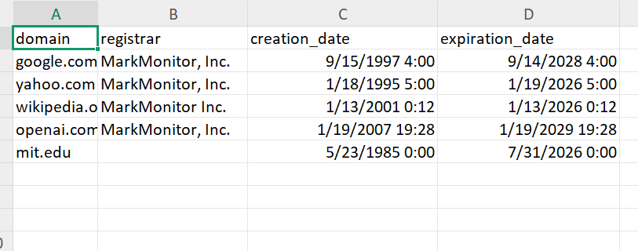
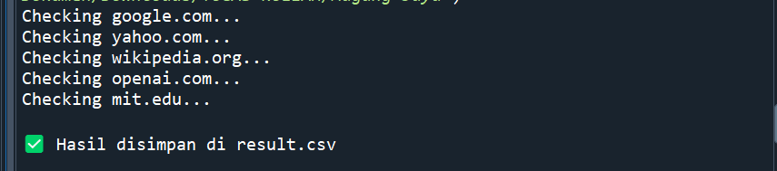

# Whois-Lookup-Automator-Python-
# Passive Recon WHOIS

Script Python sederhana untuk melakukan **WHOIS lookup otomatis** terhadap daftar domain dari file teks, lalu menyimpan hasil ringkas ke dalam file CSV.

## ✨ Fitur
- Membaca daftar domain dari `domains.txt`
- Melakukan query WHOIS untuk setiap domain
- Menyimpan hasil ringkas (Registrar, Creation Date, Expiration Date) ke `result.csv`
- Menangani error jika domain tidak dapat diproses

---

## 📦 Instalasi

1. Clone repository:
   ```bash
   git clone https://github.com/USERNAME/passive-recon-whois.git
   cd passive-recon-whois
   
## 🖼️ Screenshot Hasil Uji

Berikut adalah contoh tampilan hasil WHOIS lookup yang disimpan di `result.csv`:



Berikut contoh hasil tampilan terminal / script berjalan:




## LICENSE (MIT)
MIT License

Copyright (c) 2025

Permission is hereby granted, free of charge, to any person obtaining a copy of this software and associated documentation files (the "Software"), to deal in the Software without restriction, including without limitation the rights to use, copy, modify, merge, publish, distribute, sublicense, and/or sell copies of the Software, and to permit persons to whom the Software is furnished to do so, subject to the following conditions:

The above copyright notice and this permission notice shall be included in all copies or substantial portions of the Software.

THE SOFTWARE IS PROVIDED "AS IS", WITHOUT WARRANTY OF ANY KIND, EXPRESS OR IMPLIED, INCLUDING BUT NOT LIMITED TO THE WARRANTIES OF MERCHANTABILITY, FITNESS FOR A PARTICULAR PURPOSE AND NONINFRINGEMENT. IN NO EVENT SHALL THE AUTHORS OR COPYRIGHT HOLDERS BE LIABLE FOR ANY CLAIM, DAMAGES OR OTHER LIABILITY, WHETHER IN AN ACTION OF CONTRACT, TORT OR OTHERWISE, ARISING FROM, OUT OF OR IN CONNECTION WITH THE SOFTWARE OR THE USE OR OTHER DEALINGS IN THE SOFTWARE.
